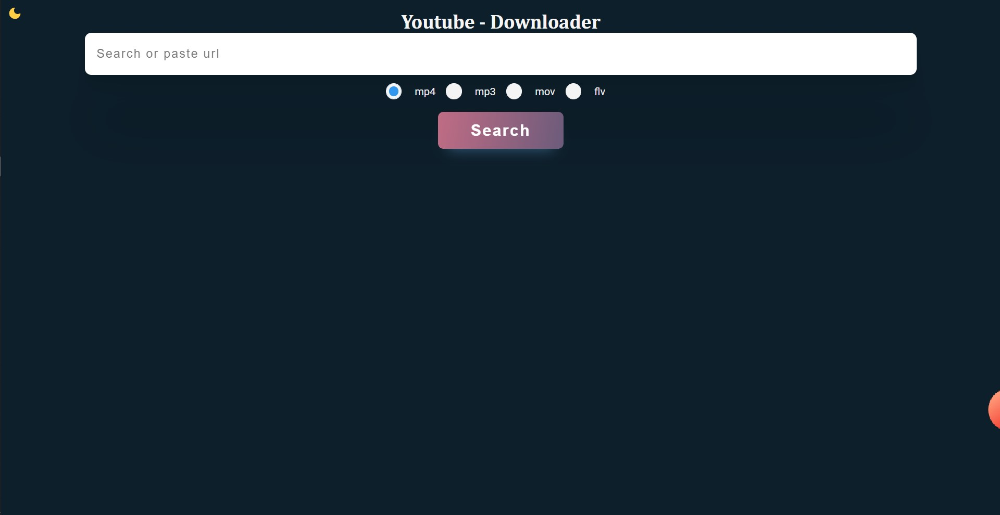
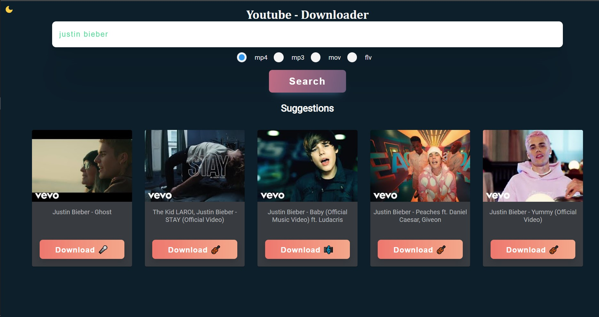
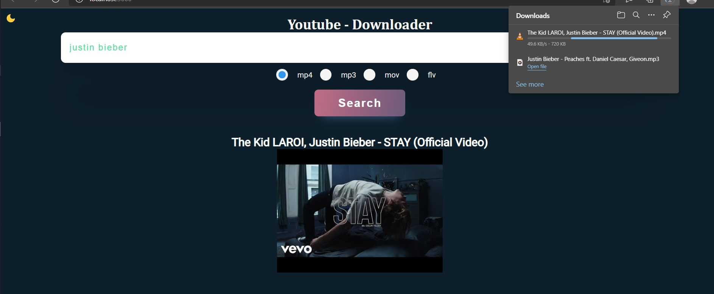

<h1 align="center">YouTube-downloader</h1>

Just paste a link or search to download your video. The available formats are mp4, mp3, mov and flv.

## Features
- Built in search
- 4 formats 🤘
- Fast in grabbing information and downloading 🚀
- Suggestions
- Responsive 😎
- Also usable on iOS & Android

## Screenshots

## Available Scripts

In the project directory, you can run:

### `yarn install`

### `yarn start` 
